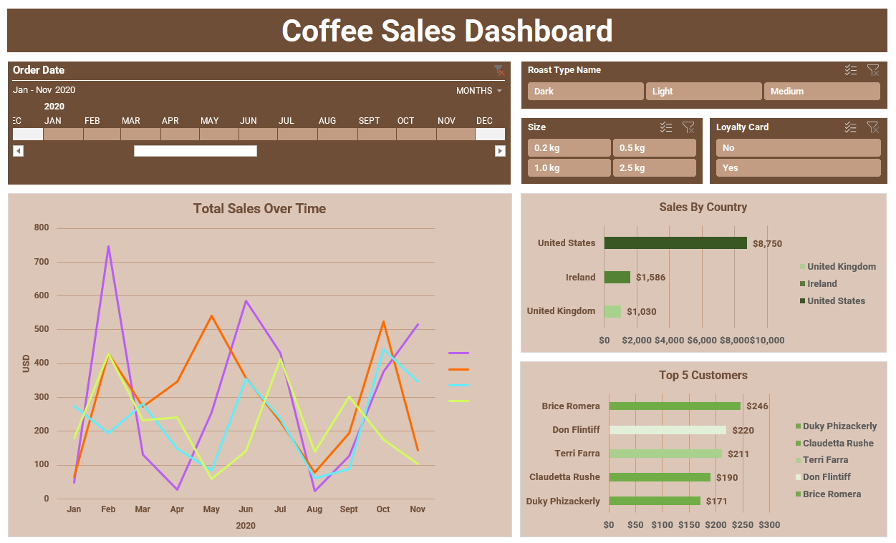
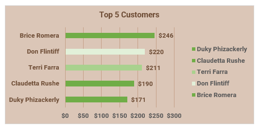

# Excel Sales Data Analysis & Visualization: Coffee Sales

## Project Overview

This project demonstrates advanced Excel data analysis and dashboard creation using a coffee sales dataset. The goal was to identify sales trends, top-performing products/regions, and key customer segments through an interactive dashboard.

## 📊 Dashboard Features

The Excel dashboard includes the following interactive elements:

*   **Timeline:** Allows filtering sales data over specific periods.
*   **Slicers (3):**
    *   Roast Type Name (Dark, Light, Medium)
    *   Size (0.2 kg, 0.5 kg, 1.0 kg, 2.5 kg)
    *   Loyalty Card (Yes/No)
*   **Charts (3):**
    *   **Total Sales Over Time:** Line chart showing sales trends.
    *   **Sales by Country:** Bar chart illustrating geographic sales distribution.
    *   **Top 5 Customers:** Bar chart identifying the customers with the highest purchase values.

## 🛠️ Tools & Techniques Used

*   **Microsoft Excel:**
    *   Data Cleaning & Preparation
    *   Pivot Tables & Pivot Charts
    *   Slicers
    *   Timeline
    *   Formulas (XLOOKUP, INDEX, MATCH)
    *   Dashboard Design

## 🖼️ Visualizations (Screenshots)

**Main Dashboard View:**

**Sales by Country Chart:**

**Top 5 Customers Chart:**

**Sales by Country Chart:**

## 💾 Data Source

The data used includes 3 sample datasets of:
* 1000 Orders, including Order ID, Order date, Customer ID, Product ID, and Quantity.
* 1000 Customers, including Customer Name, Email, Phone Number, Address Line, City, Country, Postcode, Loyalty Card info
* 48 Products, including Product ID, Coffee Type, Roast Type, Size, Unit Price, Price per 100g, Profit

## 🚀 How to Use / Explore

1.  **Download the Excel file:** `excel_file/Coffee_Sales_Analysis_Dashboard.xlsx`
2.  Open the file in Microsoft Excel.
3.  Interact with the timeline and slicers on the 'Dashboard' sheet to filter the data and observe changes in the charts.

## 💡 Key Learnings & Challenges

*   Combining data from different tables into a single one (Orders F:P). 
*   Learned to effectively combine a timeline and multiple slicers for granular data filtering.
*   Ensuring dashboard responsiveness with large pivot table datasets.
